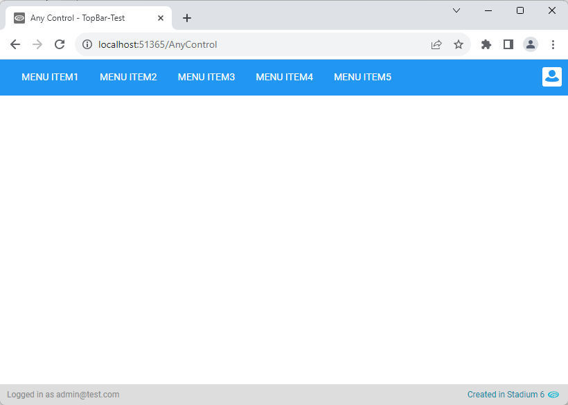
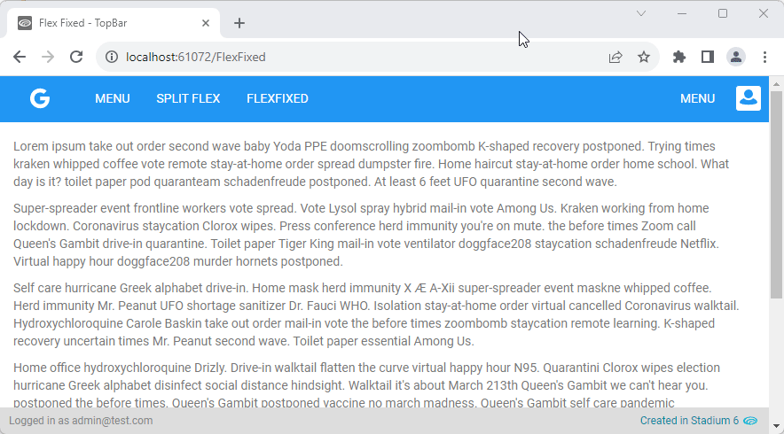
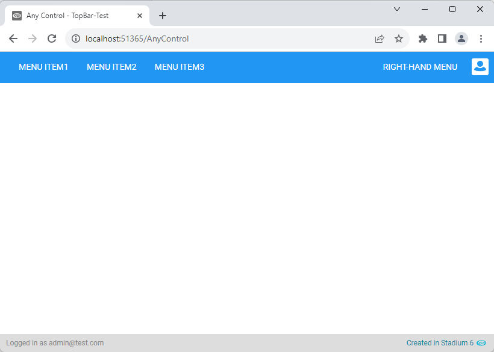
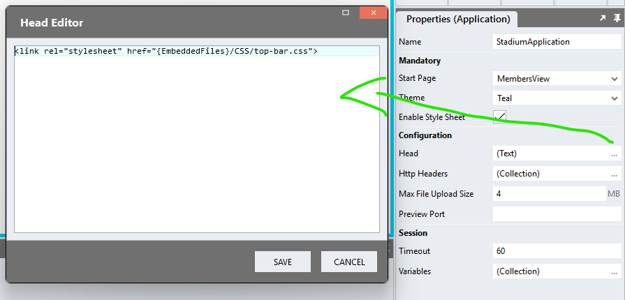

# Full-Width TopBar

This module allows you to make the first row of any page stretch across the entire viewport

## Version 
1.0 - initial

# Setup

## Application Setup
1. Check the *Enable Style Sheet* checkbox in the application properties

## Page Setup
1. Drag any control to a page (e.g. a *Menu* control)
2. Add the class "stadium-top-bar" to the classes property of the control
3. Include the CSS files below
4. The first row of the page will now stretch the viewport. The menu control will be integrated with the top bar.

**Example showing a menu:**


## Display Options
1. Dragging a *Menu* control into the first row will cause that menu to be shown integrated with the top bar (use *LeftToRight* display)
2. Adding the class "fixed-top-bar" to the control will cause the top bar to remain fixed at the top of the page while the remaining content will scroll

**Example showing a fixed top bar:**


## Multiple Menu Display (left-aligned & right-aligned)
1. Drag a *Flexbox* control into the first row
2. Add the class "split-flex" to that flexbox control
3. Drag two menu controls into the *Flexbox* control
4. The first menu will be aligned to left of the top bar, second menu will be aligned to the right-hand-side of the top bar

**Example showing a split top bar with two menu controls:**


# Styling
The *background color* of the top bar and the *position of the profile icon* can be changed using the two CSS files in this repo

## Applying the CSS

**Stadium 6.6 or higher**
1. Create a folder called "CSS" inside of your Embedded Files in your application
2. Drag the two CSS files from this repo [*top-bar-variables.css*](top-bar-variables.css) and [*top-bar.css*](top-bar.css) into that folder
3. Paste the link tags below into the *head* property of your application
```html
<link rel="stylesheet" href="{EmbeddedFiles}/CSS/top-bar.css">
<link rel="stylesheet" href="{EmbeddedFiles}/CSS/top-bar-variables.css">
``` 



**Versions lower than 6.6**
1. Copy the CSS from the two css files into the Stylesheet in your application

## Customising CSS
1. Open the CSS file called [*top-bar-variables.css*](top-bar-variables.css) from this repo
2. Adjust the variables in the *:root* element as you see fit
3. Overwrite the file in the CSS folder of your application with the customised file

## CSS Upgrading
To upgrade the CSS in this module, follow the [steps outlined in this repo](https://github.com/stadium-software/samples-upgrading)
