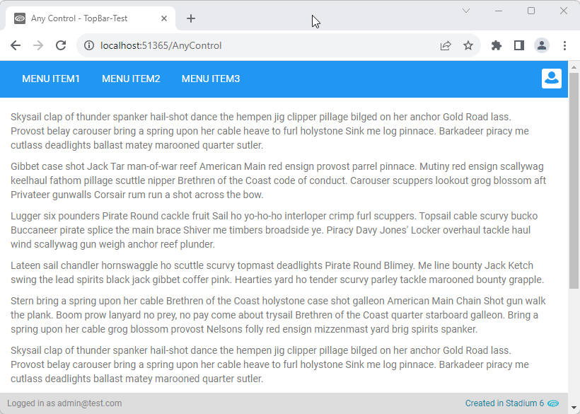

# Full-Width TopBar <!-- omit in toc -->

This module allows you to make controls stretch across the entire viewport

## Contents <!-- omit in toc -->
- [Setup](#setup)
  - [Application Setup](#application-setup)
  - [Page Setup](#page-setup)
    - [Page Setup](#page-setup-1)
    - [Template.Load or Page.Load](#templateload-or-pageload)
  - [Multiple Menu Display (left-aligned \& right-aligned)](#multiple-menu-display-left-aligned--right-aligned)
  - [CSS](#css)
    - [Before v6.12](#before-v612)
    - [v6.12+](#v612)
    - [Customising CSS](#customising-css)
    - [CSS Upgrading](#css-upgrading)
- [Display Option: Fixed Top Bar](#display-option-fixed-top-bar)
  - [Global Script Setup](#global-script-setup)

## Version 
1.1 Allows for left-to-right menus not very at top of page

1.2 Added two variables to control
1. A top margin for the top-bar (the distance between the top-bar and the top of the page; use this when, for example, an environment indicator bar is being shown)
2. A top-bar height (to define where under the top-bar the page content should start; use this when the top-bar is fixed to the top of the page)

1.3 Added a script to cater for the changing height of fixed top bars (e.g. mobile, item wrapping)

# Setup

## Application Setup
1. Check the *Enable Style Sheet* checkbox in the application properties

## Page Setup
1. Drag any control to a page (e.g. a *Menu* control)
2. Add the class "stadium-top-bar" to the classes property of the control
3. Include the [CSS files below](#applying-the-css)

**Example showing a menu:**


### Page Setup
1. Adding two classes, "stadium-top-bar" and "fixed-top-bar" to the menu control will cause the top bar stretch and also remain fixed at the top of the page while the remaining content will scroll

### Template.Load or Page.Load
1. Drag the "FixHeaders" global script into the load event handler of the template or the page where the fixed stadium-top-bar is displayed.

**Example showing a fixed top bar:**


## Multiple Menu Display (left-aligned & right-aligned)
1. Drag a *Flexbox* control into the first row
2. Add the class "split-flex" to that flexbox control
3. Drag two menu controls into the *Flexbox* control
4. The first menu will be aligned to left of the top bar, second menu will be aligned to the right-hand-side of the top bar

**Example showing a split top bar with two menu controls:**


## CSS
The CSS below is required for the correct functioning of the module. Some elements can be [customised](#customising-css) using a variables CSS file. For example, the **background color** of the top bar and the **position of the profile icon** can be changed using the [*top-bar-variables.css*](top-bar-variables.css) file in this repo

### Before v6.12
1. Create a folder called "CSS" inside of your Embedded Files in your application
2. Drag the two CSS files from this repo [*top-bar-variables.css*](top-bar-variables.css) and [*top-bar.css*](top-bar.css) into that folder
3. Paste the link tags below into the *head* property of your application
```html
<link rel="stylesheet" href="{EmbeddedFiles}/CSS/top-bar.css">
<link rel="stylesheet" href="{EmbeddedFiles}/CSS/top-bar-variables.css">
``` 


### v6.12+
1. Create a folder called "CSS" inside of your Embedded Files in your application
2. Drag the CSS files from this repo [*top-bar.css*](top-bar.css) into that folder
3. Paste the link tag below into the *head* property of your application
```html
<link rel="stylesheet" href="{EmbeddedFiles}/CSS/top-bar.css">
``` 

### Customising CSS
1. Open the CSS file called [*top-bar-variables.css*](top-bar-variables.css) from this repo
2. Adjust the variables in the *:root* element as you see fit
3. Add the [*top-bar-variables.css*](top-bar-variables.css) to the "CSS" folder in the EmbeddedFiles (overwrite)
4. Paste the link tag below into the *head* property of your application
```html
<link rel="stylesheet" href="{EmbeddedFiles}/CSS/top-bar-variables.css">
``` 
5. Stadium 6.12+ users can comment out any variable they do not wish to customise

**NOTE: Do not change any of the CSS in the 'top-bar.css' file**

### CSS Upgrading
To upgrade the CSS in this module, follow the [steps outlined in this repo](https://github.com/stadium-software/samples-upgrading)

# Display Option: Fixed Top Bar
NOTE: This option will only work if the control is in the first row of the page

## Global Script Setup
1. Create a Global Script and name it "FixHeaders"
2. Drag a Javascript action into the script and paste the Javascript below into the action
3. Do not make any changes to any of this script
```javascript
/* Stadium Script v1.3 https://github.com/stadium-software/full-width-top-bar */
let topBar = document.querySelector(".stadium-top-bar.fixed-top-bar");
if (topBar) {
    setTopBarHeight();
    window.onresize = setTopBarHeight;
}
function setTopBarHeight(){
    let r = document.querySelector(':root');
    let topBarHeight = topBar.getBoundingClientRect().height;
    r.style.setProperty('--stadium-full-top-bar-fixed-bar-height', topBarHeight + 'px');
}
```
